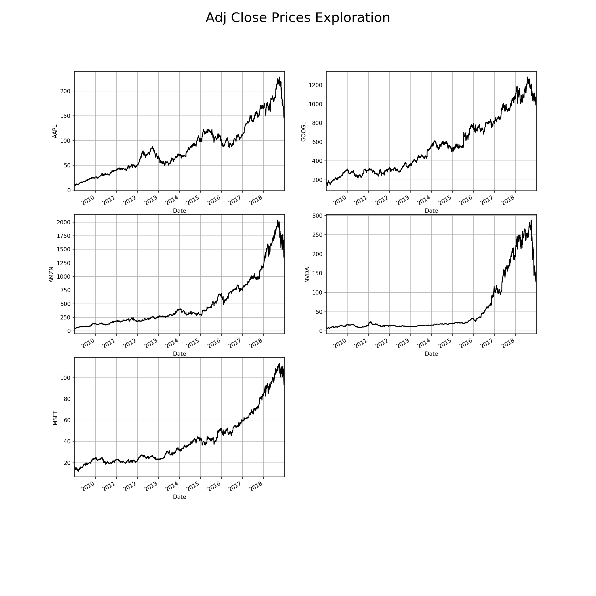
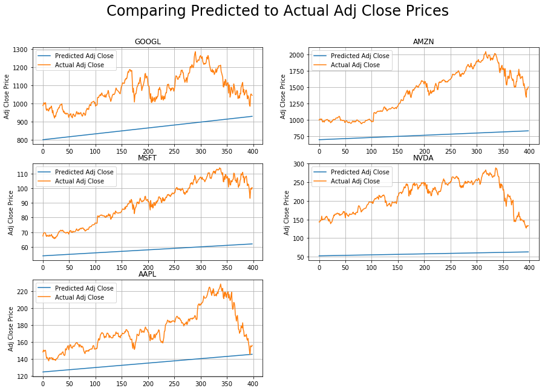
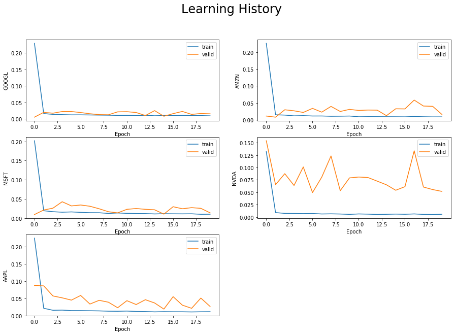
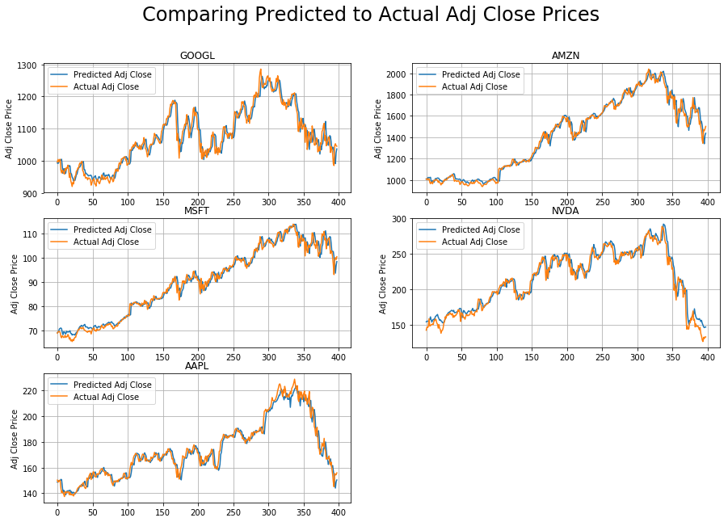
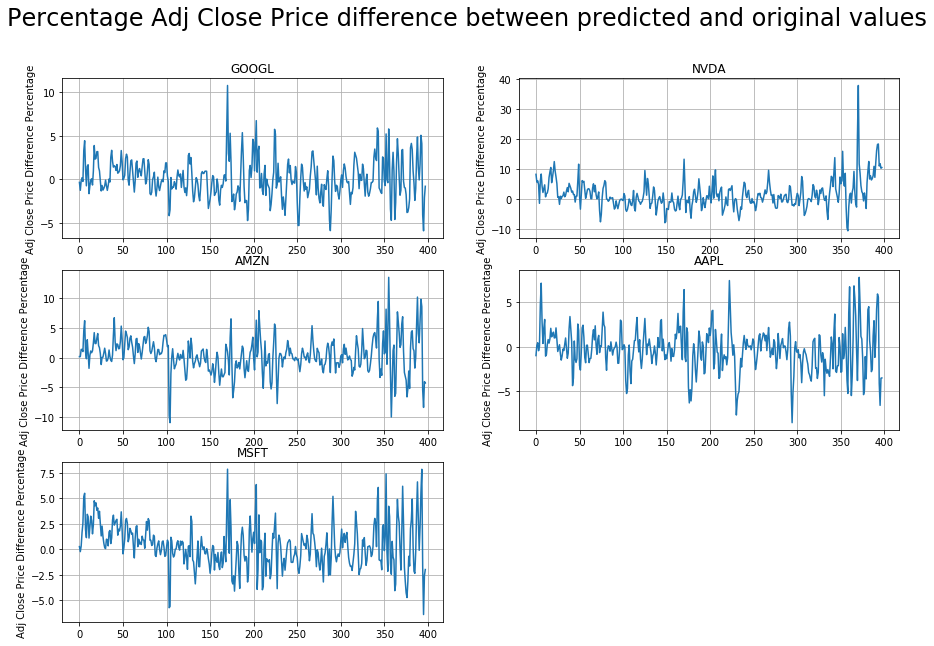

# Machine Learning Engineer Nanodegree
## Capstone Project
Chitrang Patel  
August 28, 2019

## I. Definition

### Project Overview
Technical analysis is a trading discipline employed to evaluate investments and identify trading opportunities by analyzing statistical trends gathered from trading activity, such as price movement and volume. Recent advances in Deep Learning for financial trading have shown to outperform human traders. It is incredibly valuable for ameture investors!

This project uses Recurrant Neural Nets (RNNs), particularly the Long Short Term Memory (LSTM) architechture, to predict stock prices. This technique is actively being studied and used in time series forecasting situations and also to real-world trading platforms. This project will use the Keras library to build a LSTM model to predict the adjusted closing value of stocks using historical data.

### Problem Statement

The main task for this project is to accurately predict the future adjusted closing value of a given stock for the next day given the previous day's values. The stocks that I used for this project are AAPL, MSFT, AMZN, GOOGL and NVDA.
The approach to this problem was as follows:
- Download the data using the Yahoo Historical package from pip. The data used for this project was from 2009-01-01 to 2019-01-01.
- Extract the features used in training the model and the target that we want to predict.
- Split the features and target into training and testing sets.
- Make the benchmark Linear Regression Model.
- Use the model to fit the training dataset.
- Use the trained model to predict the target values of the test dataset. 
- Evaluate the performance of this model by comparing it to the actual target values.
- Make the RNN model using the LSTM architechture.
- Use this model to fit the training dataset and learn from it.
- Use the trained model to predict the target values of the test dataset. 
- Evaluate the performance of this model by comparing it to the actual target values.

We want to then compare performance between the Linear Regression model and the RNN model.

### Metrics

Since this is a regression type of a problem, I use the R-square score and the root mean squared error as performance metrics.
`R-square` is a statistical measure of how much the variation in the target variable can be explained by the dependent variables (features) in a regression model.
`Root mean squared error` is the square root of the mean of the squares of the difference between the predicted values from the model and the actual (true) values.
Both these metrics are used heavily for regression problems in the literature.

## II. Analysis
### Data Exploration

This project explores the data for the following companies `AAPL` (Apple), `GOOGL` (Google), `AMZN` (Amazon), `NVDA` (Nvidea), and `MSFT` (Microsoft). The data for the analysis was extracted using the PyPI package `yahoo historical` from `2009-01-01` to `2019-01-01`. The data consisted of `Open`, `High`, `Low`, `Close`, `Adj Close`, and `Volume` for each day. The goal of this project is to predict the `Adj Close` price for the following day using the information in the past. Over the duration of 10 years, there were data for 2516 days since the market is open from Monday to Friday. The dataset for each ticker is summarized below in their respective tables -- `Count`, `Mean`, `Std deviation`, `Min`, and `Max` values. As clearly shown, the `Volume` values are very large compared to the other values. In order to run the models successfully, we need to scale the data to the same level. There were no missing values in the dataset.  

<table>
<caption>Table 1: AAPL</caption>
<tr><th></th> <th>Open</th> <th>High</th> <th>Low</th> <th>Close</th> <th>Adj Close</th> <th>Volume</th></tr>
<tr><td>count</td><td style="text-align: right;">2516     </td><td style="text-align: right;">2516     </td><td style="text-align: right;">2516     </td><td style="text-align: right;">2516     </td><td style="text-align: right;">2516      </td><td style="text-align: right;">2516          </td></tr>
<tr><td>mean </td><td style="text-align: right;">  91.5972</td><td style="text-align: right;">  92.4069</td><td style="text-align: right;">  90.7341</td><td style="text-align: right;">  91.5873</td><td style="text-align: right;">  85.4103 </td><td style="text-align: right;">   8.6325e+07 </td></tr>
<tr><td>std  </td><td style="text-align: right;">  50.2748</td><td style="text-align: right;">  50.6859</td><td style="text-align: right;">  49.8551</td><td style="text-align: right;">  50.2726</td><td style="text-align: right;">  50.3187 </td><td style="text-align: right;">   6.1923e+07 </td></tr>
<tr><td>min  </td><td style="text-align: right;">  11.3414</td><td style="text-align: right;">  11.7143</td><td style="text-align: right;">  11.1714</td><td style="text-align: right;">  11.1714</td><td style="text-align: right;">   9.74945</td><td style="text-align: right;">   1.14759e+07</td></tr>
<tr><td>max  </td><td style="text-align: right;"> 230.78  </td><td style="text-align: right;"> 233.47  </td><td style="text-align: right;"> 229.78  </td><td style="text-align: right;"> 232.07  </td><td style="text-align: right;"> 228.524  </td><td style="text-align: right;">   4.7025e+08 </td></tr>
</table>

<table>
<caption>Table 2: GOOGL</caption>
<tr><th></th> <th>Open</th> <th>High</th> <th>Low</th> <th>Close</th> <th>Adj Close</th> <th>Volume</th></tr>
<tr><td>count</td><td style="text-align: right;">2516    </td><td style="text-align: right;">2516    </td><td style="text-align: right;">2516    </td><td style="text-align: right;">2516    </td><td style="text-align: right;">2516    </td><td style="text-align: right;">  2516          </td></tr>
<tr><td>mean </td><td style="text-align: right;"> 554.972</td><td style="text-align: right;"> 559.659</td><td style="text-align: right;"> 549.823</td><td style="text-align: right;"> 554.842</td><td style="text-align: right;"> 554.842</td><td style="text-align: right;">     3.9364e+06 </td></tr>
<tr><td>std  </td><td style="text-align: right;"> 296.359</td><td style="text-align: right;"> 298.913</td><td style="text-align: right;"> 293.517</td><td style="text-align: right;"> 296.245</td><td style="text-align: right;"> 296.245</td><td style="text-align: right;">     2.99744e+06</td></tr>
<tr><td>min  </td><td style="text-align: right;"> 144.319</td><td style="text-align: right;"> 149.9  </td><td style="text-align: right;"> 141.517</td><td style="text-align: right;"> 141.517</td><td style="text-align: right;"> 141.517</td><td style="text-align: right;">520600          </td></tr>
<tr><td>max  </td><td style="text-align: right;">1289.12 </td><td style="text-align: right;">1291.44 </td><td style="text-align: right;">1263    </td><td style="text-align: right;">1285.5  </td><td style="text-align: right;">1285.5  </td><td style="text-align: right;">     2.96199e+07</td></tr>
</table>

<table>
<caption>Table 3: AMZN</caption>
<tr><th></th> <th>Open</th> <th>High</th> <th>Low</th> <th>Close</th> <th>Adj Close</th> <th>Volume</th></tr>
<tr><td>count</td><td style="text-align: right;">2516    </td><td style="text-align: right;">2516    </td><td style="text-align: right;">2516    </td><td style="text-align: right;">2516    </td><td style="text-align: right;">2516    </td><td style="text-align: right;">  2516          </td></tr>
<tr><td>mean </td><td style="text-align: right;"> 505.953</td><td style="text-align: right;"> 511.113</td><td style="text-align: right;"> 499.909</td><td style="text-align: right;"> 505.746</td><td style="text-align: right;"> 505.746</td><td style="text-align: right;">     4.99449e+06</td></tr>
<tr><td>std  </td><td style="text-align: right;"> 467.136</td><td style="text-align: right;"> 471.579</td><td style="text-align: right;"> 461.101</td><td style="text-align: right;"> 466.377</td><td style="text-align: right;"> 466.377</td><td style="text-align: right;">     3.44577e+06</td></tr>
<tr><td>min  </td><td style="text-align: right;">  48.56 </td><td style="text-align: right;">  50.1  </td><td style="text-align: right;">  47.63 </td><td style="text-align: right;">  48.44 </td><td style="text-align: right;">  48.44 </td><td style="text-align: right;">984400          </td></tr>
<tr><td>max  </td><td style="text-align: right;">2038.11 </td><td style="text-align: right;">2050.5  </td><td style="text-align: right;">2013    </td><td style="text-align: right;">2039.51 </td><td style="text-align: right;">2039.51 </td><td style="text-align: right;">     5.83058e+07</td></tr>
</table>

<table>
<caption>Table 4: NVDA</caption>
<tr><th></th> <th>Open</th> <th>High</th> <th>Low</th> <th>Close</th> <th>Adj Close</th> <th>Volume</th></tr>
<tr><td>count</td><td style="text-align: right;">2516     </td><td style="text-align: right;">2516     </td><td style="text-align: right;">2516     </td><td style="text-align: right;">2516     </td><td style="text-align: right;">2516      </td><td style="text-align: right;">2516          </td></tr>
<tr><td>mean </td><td style="text-align: right;">  54.7694</td><td style="text-align: right;">  55.5706</td><td style="text-align: right;">  53.8663</td><td style="text-align: right;">  54.7438</td><td style="text-align: right;">  53.8381 </td><td style="text-align: right;">   1.38323e+07</td></tr>
<tr><td>std  </td><td style="text-align: right;">  73.8333</td><td style="text-align: right;">  74.8638</td><td style="text-align: right;">  72.5991</td><td style="text-align: right;">  73.7494</td><td style="text-align: right;">  73.7429 </td><td style="text-align: right;">   9.06445e+06</td></tr>
<tr><td>min  </td><td style="text-align: right;">   7.21  </td><td style="text-align: right;">   7.47  </td><td style="text-align: right;">   7.08  </td><td style="text-align: right;">   7.21  </td><td style="text-align: right;">   6.65138</td><td style="text-align: right;">   1.1411e+06 </td></tr>
<tr><td>max  </td><td style="text-align: right;"> 289.32  </td><td style="text-align: right;"> 292.76  </td><td style="text-align: right;"> 285.58  </td><td style="text-align: right;"> 289.36  </td><td style="text-align: right;"> 288.444  </td><td style="text-align: right;">   9.23232e+07</td></tr>
</table>

<table>
<caption>Table 5: MSFT</caption>
<tr><th></th> <th>Open</th> <th>High</th> <th>Low</th> <th>Close</th> <th>Adj Close</th> <th>Volume</th></tr>
<tr><td>count</td><td style="text-align: right;">2516     </td><td style="text-align: right;">2516     </td><td style="text-align: right;">2516     </td><td style="text-align: right;">2516     </td><td style="text-align: right;">2516     </td><td style="text-align: right;">2516          </td></tr>
<tr><td>mean </td><td style="text-align: right;">  45.5529</td><td style="text-align: right;">  45.9534</td><td style="text-align: right;">  45.1356</td><td style="text-align: right;">  45.5646</td><td style="text-align: right;">  41.4448</td><td style="text-align: right;">   4.37174e+07</td></tr>
<tr><td>std  </td><td style="text-align: right;">  23.9477</td><td style="text-align: right;">  24.1402</td><td style="text-align: right;">  23.6991</td><td style="text-align: right;">  23.9257</td><td style="text-align: right;">  24.919 </td><td style="text-align: right;">   2.47416e+07</td></tr>
<tr><td>min  </td><td style="text-align: right;">  15.2   </td><td style="text-align: right;">  15.62  </td><td style="text-align: right;">  14.87  </td><td style="text-align: right;">  15.15  </td><td style="text-align: right;">  11.7711</td><td style="text-align: right;">   7.4256e+06 </td></tr>
<tr><td>max  </td><td style="text-align: right;"> 115.42  </td><td style="text-align: right;"> 116.18  </td><td style="text-align: right;"> 114.93  </td><td style="text-align: right;"> 115.61  </td><td style="text-align: right;"> 113.821 </td><td style="text-align: right;">   3.19318e+08</td></tr>
</table>

### Exploratory Visualization
The plot below shows the adjusted closing prices (`Adj Close`) for each company (`company name` shown on the `y-axis`) as a function of `date` (shown on the `x-axis`). The adjusted closing price is the target value that we are trying to predict.

  

### Algorithms and Techniques

In this project, I used the Recurrant Neural Network model using the Long Short Term Memory Architechture. The features used as input are the `Open`, `High`, `Low`, `Close`, `Adjusted Close` and `Volume` from the previous days to predict the target `Adj Close` of the following day. The hyperparameters that will be tuned are `epochs` (the number of times we want to train the model), `batch size` (how many days we want to look at during each training step) and the `optimizer` (the optimization function when fitting the model).

The data will be split into training (`2009-01-01` to `2017-05-31`) and testing (`2018-06-01` to `2019-01-01`) set after which
it will be scaled. Once scaled, the model will fit the data to the training set and tune the hyperparameters and extract the best  choice of hyperparameters. Using the best choice of hyperparameters, we will re-compile the model and apply it to the test set for predicting the following days adj closing prices and evaluate the performance metrics. This process is repeated for all the five companies.

### Benchmark

The benchmark used for this project was a linear regression model. The model was created using `Scikit-Learn`'s `LinearRegression` model. Default hyperparameters were used. The model was fit on the training data set and then applied on the test data set's features to predict the target values (`Adj Close` prices). The predicted Adj Close prices were compared to the actual Adj Close prices and the following metrics were produced for each company:

<table align="center">
<caption>Table 6: Benchmark Model's Performance </caption>
<tr><th></th> <th>R-squared score</th> <th>Root Mean Squared Error</th></tr>
<tr><td>AAPL</td><td style="text-align: right;"> -2.56287209982    </td><td style="text-align: right;">  43.429880088   </td>          </tr>
<tr><td>GOOGL </td><td style="text-align: right;"> -4.99054412757 </td><td style="text-align: right;"> 219.075335817 </td> </tr>
<tr><td>AMZN  </td><td style="text-align: right;">  -3.59015930696</td><td style="text-align: right;">  720.119868027</td> </tr>
<tr><td>NVDA  </td><td style="text-align: right;">  -13.9705382656   </td><td style="text-align: right;">  158.757250998  </td> </tr>
<tr><td>MSFT  </td><td style="text-align: right;">  -4.73631784175 </td><td style="text-align: right;"> 33.9609792838  </td> </tr>
</table>
As seen in the table, the R-squared score is negative meaning that the variation in the target values are poorly dependent on the features used in the model when using the Linear Regression model. The root mean squared error is also very high, higher than 40%.

The plot below shows the predicted values (Adj Close prices of the following day) in blue and the actual (true) values in orange. The `x-axis` shows the days (There were ~400 days in the testing dataset) for which the model was tested (`2017-06-01` to `2019-01-01`). 

  

## III. Methodology

### Data Preprocessing
As shown in the section on `Data Exploration`, compared to the features `Open`, `High`, `Low`, `Close` and `Adj Close` prices, the `Volume` values were much higher. Because of this, the data needed to be transformed and scaled to a similar level. I explored two types of scaling, `min-max` scaling using `Scikit-Learn's` `MinMaxScalar` transform where we subtract the `min` value from each feature value and then divide by the `max` feature value minus the `min` feature value. This transformation did not produce good results. My guess is that it is because the range (`max - min` value) is very different for the training dataset vs the testing dataset. This is clear from the first plot in the `Data Exploration` section where there is a clear sharp rise and a fall in the `Adj Close` prices from `2018` to `2019`, which is in the testing data set. In contrast, the early days are much gradual which are a part of the training dataset. I ended up using the following custom scaling:

- I first subtracted the global mean of the feature and target values from the individual features and targets.
- I then computed the standard deviation of the mean subtracted dataset.
- I then divided the mean subtracted dataset by the standard deviation.

The custom scaling was required to be unscaled back to the originals before comparing the predicted values and the actual target values. It showed amazing improvement over the default Min-Max scaling.

### Implementation

The implementation of the Recurrant Neural Network was done using the Keras library (which used the tensorflow backend). The RNN was a simple sequencial model which contained the following layers (in the same order):
- LSTM layer with 128 units and input shape (1, number of features - 6 in our case).
- Dropout layer with a dropout rate of 0.5 to regularize the network and get a better generalization.
- Dense layer with 1 neuron
- Activation layer with a `linear` activation function.
The model was then compiled using an input optimizer (`nadam` by default).

The model was run on the training set using different batch sizes and number of epochs that were tuned for best performance. I also used a validation set (5% of the training set) and by monitoring the validation loss, I kept track of the model's performance on the training and validation set to ensure that the model did not overfit the data as shown in the plot below.

  

### Refinement

The following hyperparameters were tuned using `Scikit-Learn's` `GridSearchCV`:
- `batch size`: the number of days after which we update the learning of the model. The choices were `10` and `30`. 
- `epochs`: the number of times the model was retrained. The choices used were `20` and `50` times.
- `optimizer`: The optimizer function used while compiling the model. The choices used were `adam` and `nadam`.

The model was tuned on the dataset of `AAPL` and performed best when it used a `batch_size=30`, `epochs=20`, `optimizer=adam`.
I also manually tried tuning the `activation` function between, `relu`, `sigmoid` and `linear`. The `linear` activation function showed the best performance. I did the same with the number of LSTM layers and it turnsout that using just a single LSTM layer performed the quickest and generalized best.

## IV. Results

### Model Evaluation and Validation

After the model was fit to the training set, it was applied to the testing dataset to output the predictions which were then unscaled back to the original level for comparison with the target test values. The RNN model was evaluated using `R-squared` score and `root mean squared errors`, just like it was done with the benchmark model. In contrast to the benchmark model, the RNN model performs extremely well, if we just compare the R-squared scores and the root mean squared errors as shown below:
<table align="center">
<caption>Table 7: RNN Model's Performance </caption>
<tr><th></th> <th>R-squared score</th> <th>Root Mean Squared Error</th></tr>
<tr><td>AAPL  </td><td style="text-align: right;"> 0.965 </td><td style="text-align: right;"> 4.3   </td> </tr>
<tr><td>GOOGL </td><td style="text-align: right;"> 0.930 </td><td style="text-align: right;"> 23.6  </td> </tr>
<tr><td>AMZN  </td><td style="text-align: right;"> 0.983 </td><td style="text-align: right;"> 44.1  </td> </tr>
<tr><td>NVDA  </td><td style="text-align: right;"> 0.951 </td><td style="text-align: right;"> 9.1   </td> </tr>
<tr><td>MSFT  </td><td style="text-align: right;"> 0.980 </td><td style="text-align: right;"> 1.99 </td> </tr>
</table>
The R-squared scores are very close to 1 meaning that the features predict the variation in the data very well. Also, the root mean squared error is about `5%` for all the stocks.

The plot showing the predicted `Adj Close` prices and the actual `Adj Close` prices are shown in the plot below. As you can see, the model performs really well throughout the testing period and for all the stocks. I also changed the split date for different sizes of the training and testing datasets and the results still seem robust against that. 

  

### Justification

By comparing the `R-squared` scores of the benchmark `linear regression` model to the `RNN` model, it's evident that the fit using the RNN model is significantly better. The scores when using the RNN model for all the stocks are between `0.93 and 0.983` which are very close to 1 showing that using this model, the variation in the target values are very well explained by the features. On the other hand, the benchmark model gives very poor `R-squared` scores (between `-14` and `-2.5`) showing that the variation in the target model is not well explained by the features. 

By comparing the `root mean squared errors` of the benchmark model to the `RNN` model, it is evident that the `RNN` model does a much better job at predicting the target values. The root mean squared error is `< ~5%` from the RNN model whereas it is `> ~40%` if we use the bench mark model.

Even though the `RNN` model can be improved, it is doing an amazing job at predicting the `Adj Close` prices of the following day. It gets worse at predicting the `Adj Close` prices for future days (eg. 10 days from today). That's where this model needs to be improved. 

## V. Conclusion
_(approx. 1-2 pages)_

### Free-Form Visualization

The plot below shows the percentage difference between predicted and actual next day's `Adjusted Closing` Prices. This plot was an eye opener as to how difficult it is to predict the future prices in time series data and that the RNN model needs to be significantly improved. Even though the `root mean squared error` is `<5%` using the RNN model, the day to day variations can be as high as `40%`! for certain stocks.  

  

### Reflection

This project uses a Recurrent Neural Network using the Long Short Term Memory architechture to predict future `Adjusted Closing` stock prices (specifically the next day but can be generalized to predict any day in the future). It goes after five stocks `AAPL`, `GOOGL`, `AMZN`, `NVDA`, and `MSFT`. It uses the features `High`, `Low`, `Open`, `Close`, `Adj Close` and `Volume` values of historical data downloaded using the python package `Yahoo Historical`. 

I then split the analysis into two stages: running the benchmark model and running the RNN model. The benchmark model chosen for this analysis was `Scikit-Learn`'s `linear regression` model where the input data was the `Adj Close` prices and the target was the same variable but for the next day. After applying the linear regression model, the performance was evaluated against the testing dataset using `R-squared` and `root mean squared errors` as evaluation metrics for the model. After this, I moved on to applying the RNN model using the LSTM architechture.

The data were split into features and target variables where the target value we want to predict was `Adj Close` of the following day and the features were all the variables from the previous days. The features and target were then split into training and testing datasets, divided using a split date. Since the values of the `Volume` variable were orders of magnitude larger than the remaining variables, the data needed to be regularized and scaled to a similar level. This was a particularly challenging aspect of the project, ie. finding the best way of scaling the data. It took me days to figure out that it was because of poor scaling that the predicted prices were not as expected for some of the stocks. I ended up using a custom scaling function where I subtracted the mean of the features from the individual values and then normalized with respect to the standard deviation of the mean subtracted data. 

Next, I applied the RNN model composed of an LSTM layer with 128 units, followed by a dropout, dense and an activation layer using the `linear` function as the activation function. The model was compiled using `adam` as the optimization function. Several hyperparameters were tuned, `batch size`, `epochs` and `optimizer`. I also manually tuned the number of layers in the neural network and the unit sizes for optimal performance. Like with the benchmark model, this model was evaluated against the testing set using `R-squared` and `root mean squared error` as performance metrics. 

I was particularly amazed at the performance of RNN when compared to the linear regression model. The differences in the evaluation metrics were shocking to me. I was very satisfied with the RNN model when it came to predicing the next days `Adj Close` prices of any stock.  

### Improvement

One thing that I would definitely improve is my RNN model architechture. It seems like it is using the actual target values from the day or two before to be the prediction of the next day. The root mean squared error seems small overall but it is similar to the daily fluctiatuon in the stock prices so in its current state, I would not employ this model as is, to actual data. Another thing that I could improve on is feature selection and use of global market indicators like data from `Dow Jones`, `S&P 500` or `Nasdaq`. Another thing to try is using a Reinforcement Learning approach to this problem. There are applications of `OpenAI` to timeseries data forecasting that could be applied here.

### References
- [Keras // Deep Learning library for Theano and TensorFlow](https://keras.io)
- [Time Series Prediction With Deep Learning in Keras](http://machinelearningmastery.com/time-series-prediction-with-deep-learning-in-python-with-keras/)
- [Yahoo Finance](http://finance.yahoo.com/)
- [Yahoo Historical // Python API](https://pypi.python.org/pypi/yahoo-historical)
- [Scikit-Learn](http://scikit-learn.org/)
